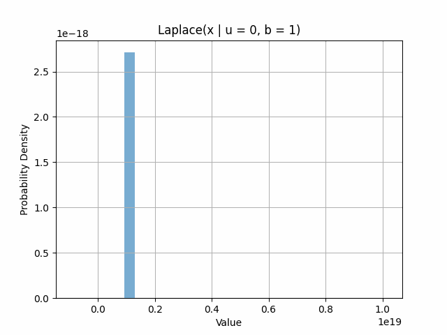

# capyCUBIT v1.0 - Additive Noise Mechanisms

[](https://github.com/auditless/cairo-template/blob/main/LICENSE) <a href="https://github.com/drcapybara/capy-cubit/actions/workflows/test.yml">  </a>

[Built with **`auditless/cairo-template`**](https://github.com/auditless/cairo-template)

[Adapted from **`cubit`**](https://github.com/whatthedev-eth/cubit)

## Box-Muller Transform for Gaussian Noise

Uniform random variables $Z_0$ and $Z_1$ have a normal distribution if their probability density functions are:

$Z_0=Rcos(\theta) = \sqrt{-2lnU_1}cos(U_22\pi)$

and

$Z_1=Rsin(\theta) = \sqrt{-2lnU_1}sin(U_22\pi)$

The Box-Muller transform of $Z_0$ and $Z_1$ gives their normal PDF:


## Laplace Distribution: 

The Laplace pdf is defined as: $f(x | \mu, b) = \frac{1}{2b}exp\left ( -\frac{|x-\mu|}{b}  \right )$ and is a critical source of noise used in privacy mechanisms such as DP-SGD:



## Methodologies:

We generate 1000 cryptographically secure random i16 values in a rust oracle which are then piped into Cairo source code and executed in bash. This is the first known example of additive noise mechanisms for the Cairo programming language using ZK-STARK technology.


## Usage

Execute the run_and_fmt script to generate a new distribution of numbers to pass into the box_muller_transform
```bash
$ ./run_and_fmt.sh
```

The values are stored in the numbers.csv file at the head of this directory.
