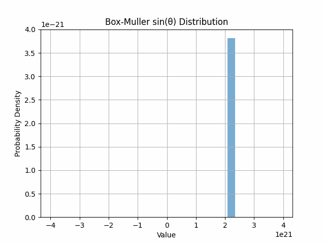

# CapyCubit v1.0    

[Built with **`auditless/cairo-template`**](https://github.com/auditless/cairo-template)

A math library with a focus on statistical distributions for machine learning, adapted from [`cubit`](https://github.com/whatthedev-eth/cubit)

## How it works

The Box-Muller transform is a means of ingesting two uniformly distrubuted variables U1 and U2:

 

and

And returning two independent normally distributed variables as a result. This gaussian noise is an important tool in privacy-preserving mechanisms such as DP-SGD for machine learning. We present here the first known example of the Box-Muller transform in the Cairo programming language built with ZK-STARK technology, directly leading to a zero knowledge circuit for provable gaussian noise generation. 

## Methodologies:

We generate 200 cryptographically secure random i16 values in rust before passing them into the cairo function. These values can be found in the tests repo. Even for a small sample size, we can observe the normal curve taking shape:

## License

[MIT](https://github.com/auditless/cairo-template/blob/main/LICENSE) © [Auditless Limited](https://www.auditless.com)
